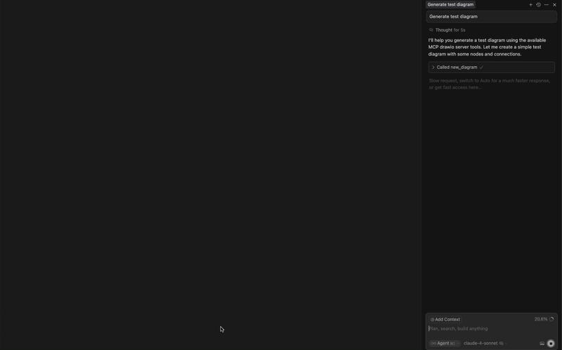

# Draw.io MCP Server

A Model Context Protocol (MCP) server that provides programmatic tools for creating and managing draw.io diagrams using mxgraph. Generate architecture diagrams, flowcharts, and other visualizations through a clean API that works with Claude Desktop and other MCP-compatible clients.

## Overview

This server enables you to build diagrams incrementally by providing stateless tools that operate on `.drawio.svg` files. Each operation specifies the target file, making it compatible with VSCode's draw.io extension while maintaining a clean separation between diagram state and server operations.

### Key Features

- **Stateless API**: Each tool call specifies the target file path
- **VSCode Compatible**: Generates `.drawio.svg` files that work seamlessly with VSCode draw.io extension
- **Rich Node Types**: Support for rectangles, ellipses, cylinders, clouds, actors, and more
- **Connection Management**: Create labeled connections with various styling options
- **Flexible Positioning**: Precise control over node placement and sizing
- **MCP Integration**: Works with Claude Desktop and other MCP-compatible applications
- **TypeScript**: Full type safety and IntelliSense support

## Demo



## Installation

### Prerequisites

- Node.js 18.0.0 or higher
- npm or yarn

### Setup

```bash
# Clone the repository
git clone https://github.com/Sujimoshi/drawio-mcp.git
cd drawio-mcp

# Install dependencies
npm install

# Build the project
npm run build
```

### Development

```bash
# Start in development mode
npm start

# Build for production
npm run build

# Clean build artifacts
npm run clean
```

## Configuration

### MCP Client Setup

Add this configuration to your MCP client (e.g., Claude Desktop, Cursor):

```json
{
  "mcpServers": {
    "drawio": {
      "command": "node",
      "args": ["/path/to/drawio-mcp/dist/index.js"]
    }
  }
}
```

### File Paths

The server supports both absolute and relative file paths:

- **Absolute**: `/Users/username/project/diagrams/architecture.drawio.svg`
- **Relative**: `./diagrams/architecture.drawio.svg` (when cwd is configured)

All diagram files should use the `.drawio.svg` extension for proper VSCode integration.

## Tools Reference

### new_diagram

Create a new empty diagram file.

**Parameters:**
- `file_path` (string, required): Path for the new diagram file

**Example:**
```json
{
  "file_path": "./diagrams/system-architecture.drawio.svg"
}
```

### add_node

Add a node to an existing diagram.

**Parameters:**
- `file_path` (string, required): Path to the diagram file
- `id` (string, required): Unique identifier for the node
- `title` (string, required): Display label (supports newlines with `\n`)
- `x` (number, required): X coordinate position
- `y` (number, required): Y coordinate position
- `kind` (string, optional): Node shape type (default: "Rectangle")
- `parent` (string, optional): Parent node ID (default: "root")
- `width` (number, optional): Custom width
- `height` (number, optional): Custom height

**Available Node Types:**
- `Rectangle`: Standard rectangular node
- `Ellipse`: Oval-shaped node  
- `Cylinder`: Database/storage representation
- `Cloud`: Cloud service representation
- `Square`: Square with fixed aspect ratio
- `Circle`: Circular node
- `Step`: Process step shape
- `Actor`: UML actor (stick figure)
- `Text`: Text-only node

**Example:**
```json
{
  "file_path": "./diagrams/system-architecture.drawio.svg",
  "id": "user-service",
  "title": "User Service\nAPI Layer",
  "kind": "Rectangle",
  "x": 100,
  "y": 150,
  "width": 120,
  "height": 80
}
```

### link_nodes

Create a connection between two existing nodes.

**Parameters:**
- `file_path` (string, required): Path to the diagram file
- `from` (string, required): Source node ID
- `to` (string, required): Target node ID
- `title` (string, optional): Connection label
- `dashed` (boolean, optional): Whether to use dashed line style
- `reverse` (boolean, optional): Whether to reverse arrow direction

**Example:**
```json
{
  "file_path": "./diagrams/system-architecture.drawio.svg",
  "from": "user-service",
  "to": "database",
  "title": "queries",
  "dashed": true
}
```

### edit_node

Modify properties of an existing node.

**Parameters:**
- `file_path` (string, required): Path to the diagram file
- `id` (string, required): Node ID to update
- `title` (string, optional): New display label
- `kind` (string, optional): New shape type
- `x` (number, optional): New X coordinate
- `y` (number, optional): New Y coordinate
- `width` (number, optional): New width
- `height` (number, optional): New height

**Example:**
```json
{
  "file_path": "./diagrams/system-architecture.drawio.svg",
  "id": "user-service",
  "title": "Updated User Service",
  "x": 200,
  "y": 100
}
```

### remove_nodes

Remove one or more nodes from a diagram.

**Parameters:**
- `file_path` (string, required): Path to the diagram file
- `ids` (array, required): Array of node IDs to remove

**Example:**
```json
{
  "file_path": "./diagrams/system-architecture.drawio.svg",
  "ids": ["old-service", "deprecated-db"]
}
```

### get_diagram_info

Retrieve information about a diagram including nodes and connections.

**Parameters:**
- `file_path` (string, required): Path to the diagram file

**Example:**
```json
{
  "file_path": "./diagrams/system-architecture.drawio.svg"
}
```

## Output Format

Diagrams are saved as `.drawio.svg` files with embedded metadata:

- **SVG Format**: Clean vector graphics suitable for web and print
- **Draw.io Metadata**: Full diagram data embedded in SVG for editing
- **VSCode Compatible**: Open directly in VSCode with draw.io extension
- **Self-contained**: No external dependencies or additional files needed

## Development

### Project Structure

```
src/
├── Graph.ts              # Core graph data structure
├── GraphFileManager.ts   # File I/O operations  
├── Logger.ts            # Logging utilities
├── index.ts             # MCP server entry point
├── mcp/                 # MCP tool implementations
│   ├── McpServer.ts     # Server framework
│   ├── NewDiagramTool.ts
│   ├── AddNodeTool.ts
│   ├── LinkNodesTools.ts
│   ├── EditNodeTool.ts
│   ├── RemoveNodesTool.ts
│   └── GetDiagramInfoTool.ts
└── mxgraph/             # mxgraph integration
    ├── index.ts
    └── jsdom.ts
```

### Building From Source

```bash
# Install dependencies
npm install

# Run TypeScript compilation
npm run build

# Start development server
npm start

# Run linting
npm run lint
```

## Support

- Create an issue on GitHub for bugs and feature requests
- Check existing issues before creating new ones
- Provide detailed reproduction steps for bug reports
